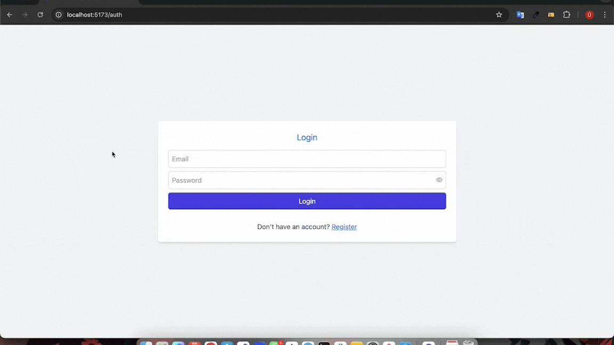

<h1>MERN Stack Post App</h1>

Bu proje, kimlik doğrulama ile kullanıcı kaydı ve girişi yapabilen, kullanıcıların post ekleyip güncelleyebildiği ve silebildiği bir post paylaşım uygulamasıdır.

<h2>Kullanılan Teknolojiler</h2>

Backend (Node.js & Express)

- Express.js: Sunucu tarafı uygulaması

- MongoDB & Mongoose: Veritabanı yönetimi

- bcryptjs: Şifre güvenliği için şifreleme

- jsonwebtoken (JWT): Kimlik doğrulama

- dotenv: Çevresel değişken yönetimi

- cors: API erişim kontrolü

- body-parser: İsteklerin gövdesini ayrıştırma

- nodemon: Geliştirme sırasında sunucuyu otomatik olarak yeniden başlatm

Frontend (React & Vite)

- React: Kullanıcı arayüzü

- React Router Dom: Sayfa yönlendirme

- Redux & Redux Thunk: Global durum yönetimi

- Axios: API istekleri için HTTP istemcisi

- React Icons: UI ikonları

- React Toastify: Bildirim yönetimi

- Tailwind CSS: Stiller için hızlı ve ölçeklenebilir bir CSS framework'ü

<h2>Özellikler</h2>

- Kullanıcı kaydı ve girişi (JWT tabanlı kimlik doğrulama)

- Post oluşturma, düzenleme ve silme

- Redux ile global state yönetimi

- Responsive ve modern arayüz

- Hata yönetimi ve bildirimler (React Toastify)

<h2>Ekran Videosu</h2>

